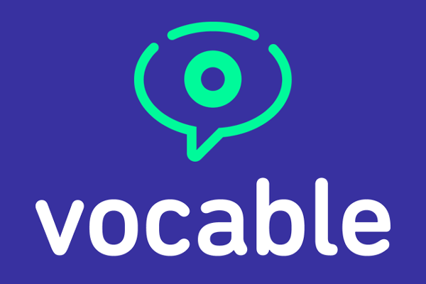

# eyespeak for iOS

Empowering people to communicate with care takers and loved ones.

## Contents
- [What is Vocable?](#what-is-vocable)
- [Features](#features)
- [Roadmap](#roadmap)
- [Contributing](#contributing)
- [Requirements](#requirements)
- [Build instructions](#build-instructions)
- [Credits](#credits)
- [License](#license)

## What is Vocable?
Vocable AAC allows those with conditions such as MS, stroke, ALS, or spinal cord injuries to communicate using an app that tracks head movements, without the need to spend tens of thousands of dollars on technology to do so.

## Features

## Roadmap

## In-Progress:

## Up Next:

## Future:

## Contributing

## Requirements
- iOS 13.0
- iOS devices with TrueDepth camera (currently iPad Pro only for v1.0)

## Build instructions

## Credits
Matt Kubota, Kyle Ohanian, Duncan Lewis, Ameir Al-Zoubi, and many more from [WillowTree](https://willowtreeapps.com/) 💙.

## License
vocable-ios is released under the MIT license. See [LICENSE](LICENSE) for details.
